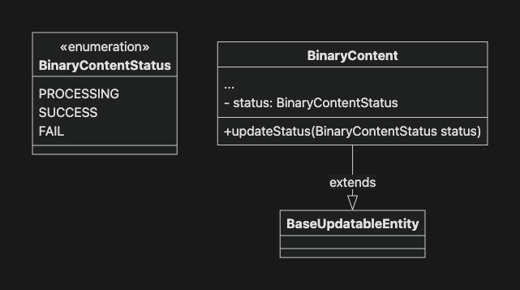
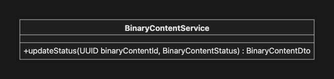
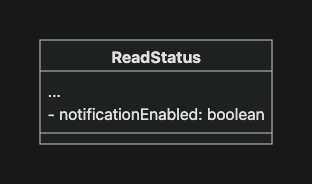
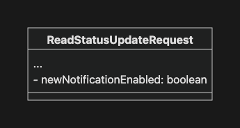
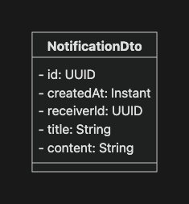
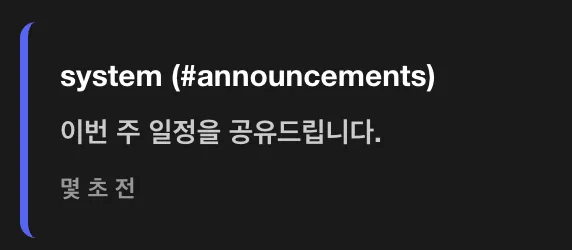
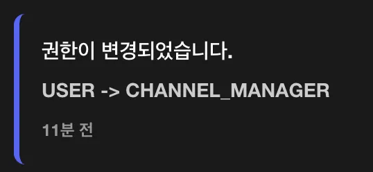
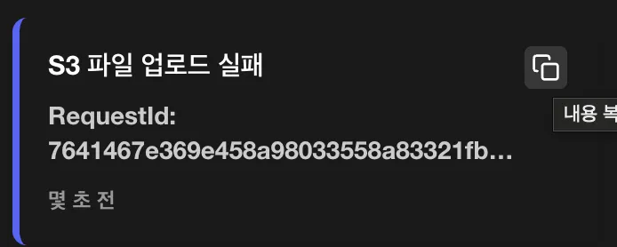
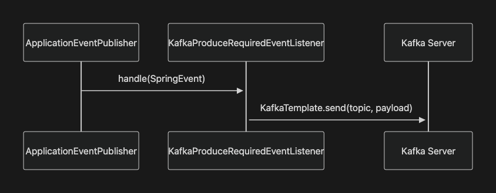

# 프로젝트 마일스톤

- 비동기를 통해 응답 속도 향상하기
- 캐시를 통해 DB I/O 줄이기
- Kafka 도입하기
- Redis 도입하기

---

# 기본 요구사항

## Spring Event - 파일 업로드 로직 분리하기

- 디스코드잇은 BinaryContent의 메타 데이터(DB)와 바이너리 데이터(FileSystem/S3)를 분리해 저장합니다.
- 만약 지금처럼 두 로직이 하나의 트랜잭션으로 묶인 경우 트랜잭션을 과도하게 오래 점유할 수 있는 문제가 있습니다.
    - 바이너리 데이터 저장 연산은 오래 걸릴 수 있는 연산이며, 해당 연산이 끝날 때까지 트랜잭션이 대기해야 합니다.
- 따라서 Spring Event를 활용해 메타 데이터 저장 트랜잭션으로부터 바이너리 데이터 저장 로직을 분리하여, 메타데이터 저장 트랜잭션이 종료되면 바이너리 데이터를 저장하도록 변경합니다.

### BinaryContentCreatedEvent 발행

- [x] `BinaryContentStorage.put`을 직접 호출하는 대신 `BinaryContentCreatedEvent`를 발행하세요.
    - `BinaryContentCreatedEvent`를 정의하세요.
        - `BinaryContent` 메타 정보가 DB에 잘 저장되었다는 사실을 의미하는 이벤트입니다.
    - 다음의 메소드에서 `BinaryContentStorage`를 호출하는 대신 `BinaryContentCreatedEvent`를 발행하세요.
        - `UserService.create`/`update`
        - `MessageService.create`
        - `BinaryContentService.create`
    - `ApplicationEventPublisher`를 활용하세요.

### 이벤트 리스너 구현

- [x] 이벤트를 받아 실제 바이너리 데이터를 저장하는 리스너를 구현하세요.
    - 이벤트를 발행한 메인 서비스의 트랜잭션이 커밋되었을 때 리스너가 실행되도록 설정하세요.
    - `BinaryContentStorage`를 통해 바이너리 데이터를 저장하세요.

### 메타 데이터 리팩토링

- [x] 바이너리 데이터 저장 성공 여부를 알 수 있도록 메타 데이터를 리팩토링하세요.

  

    - `BinaryContent`에 바이너리 데이터 업로드 상태 속성(`status`)을 추가하세요.

      

        - `PROCESSING`: 업로드 중 (기본값)
        - `SUCCESS`: 업로드 완료
        - `FAIL`: 업로드 실패

      ```sql
      -- schema.sql
      CREATE TABLE binary_contents
      (
          id           uuid PRIMARY KEY,
          created_at   timestamp with time zone NOT NULL,
          updated_at   timestamp with time zone,
          file_name    varchar(255)             NOT NULL,
          size         bigint                   NOT NULL,
          content_type varchar(100)             NOT NULL,
          status       varchar(20)              NOT NULL
      );
  
      -- ALTER TABLE binary_contents
      -- ADD COLUMN updated_at timestamp with time zone;
      -- ALTER TABLE binary_contents
      -- ADD COLUMN status varchar(20) NOT NULL;
      ```

    - `BinaryContent`의 상태를 업데이트하는 메소드를 정의하세요.

      

        - 트랜잭션 전파 범위에 유의하세요.

    - [x] 바이너리 데이터 저장 성공 여부를 메타 데이터에 반영하세요.
        - 성공 시 `BinaryContent`의 `status`를 `SUCCESS`로 업데이트하세요.
        - 실패 시 `BinaryContent`의 `status`를 `FAIL`로 업데이트하세요.

---

## Spring Event - 알림 기능 추가하기

`1) 채널에 새로운 메시지가 등록`되거나 `2) 권한이 변경된 경우` 이벤트를 발행해 알림을 받을 수 있도록 구현합니다.

### 채널 메시지 알림

- [x] 채널에 새로운 메시지가 등록된 경우 알림을 받을 수 있도록 리팩토링하세요.
    - `MessageCreatedEvent`를 정의하고 새로운 메시지가 등록되면 이벤트를 발행하세요.
    - 사용자 별로 관심있는 채널의 알림만 받을 수 있도록 ReadStatus 엔티티에 채널 알림 여부 속성(`notificationEnabled`)을 추가하세요.

      

        - PRIVATE 채널은 알림 여부를 `true`로 초기화합니다.
        - PUBLIC 채널은 알림 여부를 `false`로 초기화합니다.

      ```sql
      -- schema.sql
      CREATE TABLE read_statuses
      (
          id                   uuid PRIMARY KEY,
          created_at           timestamp with time zone NOT NULL,
          updated_at           timestamp with time zone,
          user_id              uuid                     NOT NULL,
          channel_id           uuid                     NOT NULL,
          last_read_at         timestamp with time zone NOT NULL,
          notification_enabled boolean                  NOT NULL,
          UNIQUE (user_id, channel_id)
      );
  
      -- ALTER TABLE read_statuses
      -- ADD COLUMN notification_enabled boolean NOT NULL;
      ```

    - 알림 여부를 수정할 수 있게 `ReadStatusUpdateRequest`를 수정하세요.

      

        - 알림이 활성화 되어 있는 경우

          

        - 알림이 활성화 되어 있지 않은 경우

          

### 권한 변경 알림

- [x] 사용자의 권한(Role)이 변경된 경우 알림을 받을 수 있도록 리팩토링하세요.
    - `RoleUpdatedEvent`를 정의하고 권한이 변경되면 이벤트를 발행하세요.

### 알림 API 구현

- [x] 알림 API를 구현하세요.
    - `NotificationDto`를 정의하세요.

      

        - `receiverId`: 알림을 수신할 User의 `id`입니다.

    - 알림 조회
        - 엔드포인트: `GET /api/notifications`
        - 요청
            - 헤더: 액세스 토큰
        - 응답
            - `200 List<NotificationDto>`
            - `401 ErrorResponse`
    - 알림 확인
        - 엔드포인트:
        - 요청:
            - 헤더: 액세스 토큰
        - 응답
            - `204 Void`
            - 인증되지 않은 요청: `401 ErrorResponse`
            - 인가되지 않은 요청: `403 ErrorResponse`
                - 요청자 본인의 알림에 대해서만 수행할 수 있습니다.
            - 알림이 없는 경우: `404 ErrorResponse`

### 알림 이벤트 리스너 구현

- [x] 알림이 필요한 이벤트가 발행되었을 때 알림을 생성하세요.
    - 이벤트를 처리할 리스너를 구현하세요.
        ```java
        public class NotificationRequiredEventListener {
        
            @TransactionalEventListener
            public void on(MessageCreatedEvent event) { }
        
            @TransactionalEventListener
            public void on(RoleUpdatedEvent event) { }
        }
        ```
        - `on(MessageCreatedEvent)`
            - 해당 채널의 알림 여부를 활성화한 `ReadStatus`를 조회합니다.
            - 해당 `ReadStatus`의 사용자들에게 알림을 생성합니다.
                ```
                # 알림 예시
                title: "보낸 사람 (#채널명)"
                content: "메시지 내용"
                ```

              

            - 단, 해당 메시지를 보낸 사람은 알림 대상에서 제외합니다.
        - `on(RoleUpdatedEvent)`
            - 권한이 변경된 당사자에게 알림을 생성합니다.
                ```
                # 알림 예시
                title: "권한이 변경되었습니다."
                content: "USER -> CHANNEL_MANAGER"
                ```

              

---

## 비동기 적용하기

### 비동기 설정

- [x] 비동기를 적용하기 위한 설정(`AsyncConfig`) 클래스를 구현하세요.
    - `@EnableAsync` 어노테이션을 활용하세요.
    - `TaskExecutor`를 Bean으로 등록하세요.
    - `TaskDecorator`를 활용해 MDC의 Request ID, SecurityContext의 인증 정보가 비동기 스레드에서도 유지되도록 구현하세요.

### 비동기 이벤트 리스너

- [x] 앞서 구현한 Event Listener를 비동기적으로 처리하세요.
    - `@Async` 어노테이션을 활용하세요.

### 성능 비교

- [x] 동기 처리와 비동기 처리 간 성능 차이를 비교해보세요.
    - 파일 업로드 로직에 의도적인 지연(`Thread.sleep(...)`)을 발생시키세요.

      ```java
      // LocalBinaryContentStorage
      public UUID put(UUID binaryContentId, byte[] bytes) {
          try {
              Thread.sleep(3000);
          } catch (InterruptedException e) {
              Thread.currentThread().interrupt();
              throw new RuntimeException("Thread interrupted while simulating delay", e);
          }
          // ...
      }
      ```

    - 메시지 생성 API의 실행 시간을 측정해보세요.
        - `@Timed` 어노테이션을 메소드에 추가합니다.

          ```java
          // MessageController
          @Timed("message.create.async")
          @PostMapping(consumes = MediaType.MULTIPART_FORM_DATA_VALUE)
          public ResponseEntity<MessageDto> create() {  }
          ```

        - Actuator 설정을 추가합니다.

          ```yaml
          # application.yaml
          management:
            observations:
              annotations:
                enabled: true
          ```

        - `/actuator/metrics/message.create.async`에서 측정된 시간을 확인할 수 있습니다.

    - `@EnableAsync`를 활성화/비활성화 해보면서 동기/비동기 처리 간 응답 속도의 차이를 확인해보세요.

---

## 비동기 실패 처리하기

- 비동기로 처리하는 로직이 실패하는 경우 사용자에게 즉각적인 에러 전파가 되지 않을 가능성이 높습니다.
- 따라서 비동기로 처리하는 로직은 자동 재시도 전략을 통해 더 견고하게 구현해야 합니다.
- 또, 실패하더라도 그 사실을 명확하게 기록해두어야 에러에 대응할 수 있습니다.

### 자동 재시도

- [x] S3를 활용해 바이너리 데이터 저장 시 자동 재시도 매커니즘을 구축하세요.
    - Spring Retry를 위한 환경을 구성하세요.
        - `org.springframework.retry:spring-retry` 의존성을 추가하세요.
        - `@EnableRetry` 어노테이션을 활용해 Spring Retry를 활성화하세요.
    - 바이너리 데이터를 저장하는 메소드에 `@Retryable` 어노테이션을 사용해 재시도 정책(횟수, 대기 시간 등)을 설정하세요.

### 실패 대응 전략

- [x] 재시도가 모두 실패했을 때 대응 전략을 구축하세요.
    - `@Recover` 어노테이션을 활용하세요.
    - 실패 정보를 관리자에게 통지하세요.

      

      ```
      # 알림 내용 예시
      RequestId: 7641467e369e458a98033558a83321fb
      BinaryContentId: b0549c2a-014c-4761-8b21-4b77d3bd011c
      Error: The AWS Access Key Id you provided does not exist in our records. (Service: S3, Status Code: 403, Request ID: B7KCVSRCGPYJZREX, Extended Request ID: AWRVuJJJ3upwwOkCnd+yhHkgSajUxdg7L4195lbMVTIka6WnBpjZLLRTReoHbgIMf9zzH/QQM0Y5ZOVJCHF2F+l2mSyPG/+8Ee2XBS8hcqk=) (SDK Attempt Count: 1)
      ```

        - 실패 정보에는 추후 디버깅을 위해 필요한 정보를 포함하세요.
            - 실패한 작업 이름
            - MDC의 Request ID
            - 실패 이유 (예외 메시지)

---

## 캐시 적용하기

### Caffeine 캐시 환경 구성

- [x] Caffeine 캐시를 위한 환경을 구성하세요.
    - `org.springframework.boot:spring-boot-starter-cache` 의존성을 추가하세요.
    - `com.github.ben-manes.caffeine:caffeine` 의존성을 추가하세요.
    - `application.yaml` 설정 또는 Bean을 통해 Caffeine 캐시를 설정하세요.

### 캐시 적용

- [x] `@Cacheable` 어노테이션을 활용해 캐시가 필요한 메소드에 적용하세요.
    - 사용자별 채널 목록 조회
    - 사용자별 알림 목록 조회
    - 사용자 목록 조회

### 캐시 갱신/무효화

- [x] 데이터 변경 시, 캐시를 갱신 또는 무효화하는 로직을 구현하세요.
    - `@CacheEvict`, `@CachePut`, `CacheManager` 등을 활용하세요.
    - 예시:
        - 새로운 채널 추가/수정/삭제 → 채널 목록 캐시 무효화
        - 알림 추가/삭제 → 알림 목록 캐시 무효화
        - 사용자 추가/로그인/로그아웃 → 사용자 목록 캐시 무효화

### 캐시 효과 확인

- [x] 캐시 적용 전후의 차이를 비교해보세요.
    - 로그를 통해 SQL 실행 여부를 확인해보세요.

- [x] Spring Actuator를 활용해 캐시 관련 통계 지표를 확인해보세요.
    - Caffeine Spec에 `recordStats` 옵션을 추가하세요.

      ```yaml
      # application.yaml
      cache:
        caffeine:
          spec: >
            maximumSize=100,
            expireAfterAccess=600s,
            recordStats
      ```

    - `/actuator/caches`, `/actuator/metrics/cache.*`를 통해 캐시 관련 데이터를 확인해보세요.

---

# 심화 요구사항

## 유의사항

- 이번 실습은 분산 환경을 대비한 기술 도입을 목표로 합니다. 특히, 여러 서버나 인스턴스로 구성되는 시스템에서 발생할 수 있는 문제를 해결하는 데 필요한 기술을 학습합니다.
    - Kafka를 통한 이벤트 발행/구독
    - Redis를 활용한 전역 캐시 저장소 구성
- 이번 미션에서는 Kafka, Redis의 세부 설정이나 고급 기능보다는, 기술을 간단하게 적용하고, 분산 환경의 필요성과 기존 시스템의 한계를 이해하는 데 집중해주세요.

---

## Spring Kafka 도입하기

- 회원이 늘어나면서 알림 연산량이 급증해 알림 기능만 별도의 마이크로 서비스로 분리하기로 결정했다고 가정해봅시다.
- 이제 알림 서비스와 메인 서비스는 완전히 분리된 서버이므로 Spring Event만을 통해서 이벤트를 발행/소비할 수 없습니다.
- 따라서 메인 서비스에서 Kafka를 통해 서버 외부로 이벤트를 발행하고, 알림 서비스에서는 서버 외부의 이벤트를 소비할 수 있도록 해야 합니다.

### Kafka 환경 구성

- [ ] Kafka 환경을 구성하세요.
    - Docker Compose를 활용해 Kafka를 구동하세요.

      ```yaml
      # docker-compose-kafka.yaml
      # https://developer.confluent.io/confluent-tutorials/kafka-on-docker/#the-docker-compose-file
  
      services:
        broker:
          image: apache/kafka:latest
          hostname: broker
          container_name: broker
          ports:
            - 9092:9092
          environment:
            KAFKA_BROKER_ID: 1
            KAFKA_LISTENER_SECURITY_PROTOCOL_MAP: PLAINTEXT:PLAINTEXT,PLAINTEXT_HOST:PLAINTEXT,CONTROLLER:PLAINTEXT
            KAFKA_ADVERTISED_LISTENERS: PLAINTEXT://broker:29092,PLAINTEXT_HOST://localhost:9092
            KAFKA_OFFSETS_TOPIC_REPLICATION_FACTOR: 1
            KAFKA_GROUP_INITIAL_REBALANCE_DELAY_MS: 0
            KAFKA_TRANSACTION_STATE_LOG_MIN_ISR: 1
            KAFKA_TRANSACTION_STATE_LOG_REPLICATION_FACTOR: 1
            KAFKA_PROCESS_ROLES: broker,controller
            KAFKA_NODE_ID: 1
            KAFKA_CONTROLLER_QUORUM_VOTERS: 1@broker:29093
            KAFKA_LISTENERS: PLAINTEXT://broker:29092,CONTROLLER://broker:29093,PLAINTEXT_HOST://0.0.0.0:9092
            KAFKA_INTER_BROKER_LISTENER_NAME: PLAINTEXT
            KAFKA_CONTROLLER_LISTENER_NAMES: CONTROLLER
            KAFKA_LOG_DIRS: /tmp/kraft-combined-logs
            CLUSTER_ID: MkU3OEVBNTcwNTJENDM2Qk
      ```

      ```bash
      docker compose -f docker-compose-kafka.yaml up -d
      ```

    - Spring Kafka 의존성을 추가하고, `application.yaml`에 Kafka 설정을 추가하세요.

      ```groovy
      implementation 'org.springframework.kafka:spring-kafka'
      ```

      ```yaml
      # application.yaml
      spring:
        kafka:
          bootstrap-servers: localhost:9092
          producer:
            key-serializer: org.apache.kafka.common.serialization.StringSerializer
            value-serializer: org.apache.kafka.common.serialization.StringSerializer
          consumer:
            group-id: discodeit-group
            auto-offset-reset: earliest
            key-deserializer: org.apache.kafka.common.serialization.StringDeserializer
            value-deserializer: org.apache.kafka.common.serialization.StringDeserializer
      ```

### Kafka 이벤트 발행

- [x] Spring Event를 Kafka로 발행하는 리스너를 구현하세요.
    - `NotificationRequiredEventListener`는 비활성화하세요.
    - `KafkaProduceRequiredEventListener`를 구현하세요.

        ```java
        package com.sprint.mission.discodeit.event.kafka;
  
        @Slf4j
        @RequiredArgsConstructor
        @Component
        public record KafkaProduceRequiredEventListener(
                KafkaTemplate<String, String> kafkaTemplate,
                ObjectMapper objectMapper
            ) {

            @Async
            @TransactionalEventListener
            public void on(MessageCreatedEvent event) {
                String payload = objectMapper.writeValueAsString(event);
                kafkaTemplate.send("discodeit.MessageCreatedEvent", payload);
            }

            @Async
            @TransactionalEventListener
            public void on(RoleUpdatedEvent event) { }

            @Async
            @EventListener
            public void on(S3UploadFailedEvent event) { }
        }
        ```

        - Spring Event를 Kafka 메시지로 변환해 전송하는 중계 구조입니다.

          

### Kafka 이벤트 확인

- [x] Kafka Console을 통해 Kafka 이벤트가 잘 발행되는지 확인해보세요.
    - broker 컨테이너 쉘 접속

      ```bash
      docker exec -it -w /opt/kafka/bin broker sh
      ```

    - 토픽 리스트 확인 (실행위치: `/opt/kafka/bin`)

      ```bash
      ./kafka-topics.sh --list --bootstrap-server broker:29092
  
      # 출력 예시
      __consumer_offsets
      discodeit.MessageCreatedEvent
      ...
      ```

    - 특정 토픽 이벤트 구독 및 대기 (실행위치: `/opt/kafka/bin`)

      ```bash
      ./kafka-console-consumer.sh --topic discodeit.MessageCreatedEvent --from-beginning --bootstrap-server broker:29092
      ```

### Kafka 이벤트 구독

- [x] Kafka 토픽을 구독해 알림을 생성하는 리스너를 구현하세요.
    - 이 리스너는 메인 서비스와 별도의 서버로 구성된 알림 서비스라고 가정합니다.
    - `NotificationRequiredTopicListener`를 구현하세요.

      ```java
      package com.sprint.mission.discodeit.event.kafka;
  
      @Slf4j
      @RequiredArgsConstructor
      @Component
      public record NotificationRequiredTopicListener(
          ObjectMapper objectMapper
      ) {
          @KafkaListener(topics = "discodeit.MessageCreatedEvent")
          public void onMessageCreatedEvent(String kafkaEvent) {
              try {
                  MessageCreatedEvent event = objectMapper.readValue(kafkaEvent,
                      MessageCreatedEvent.class);
              } catch (JsonProcessingException e) {
                  throw new RuntimeException(e);
              }
          }
  
          @KafkaListener(topics = "discodeit.RoleUpdatedEvent")
          public void onRoleUpdatedEvent(String kafkaEvent) { }
  
          @KafkaListener(topics = "discodeit.S3UploadFailedEvent")
          public void onS3UploadFailedEvent(String kafkaEvent) { }
      }
      ```

    - 기존 `@EventListener` 기반 로직을 제거하고 `@KafkaListener`로 대체하세요.

---

## Redis Cache 도입하기

- 대용량 트래픽을 감당하기 위해 서버의 인스턴스를 여러 개로 늘렸다고 가정해봅시다.
- `Caffeine`과 같은 로컬 캐시는 서로 다른 서버에서 더 이상 활용할 수 없습니다. 따라서 Redis를 통해 전역 캐시 저장소를 구성합니다.

### Redis 환경 구성

- [x] Redis 환경을 구성하세요.
    - Docker Compose를 활용해 Redis를 구동하세요.

      ```yaml
      # docker-compose-redis.yml
      services:
        redis:
          image: redis:7.2-alpine
          container_name: redis
          ports:
            - "6379:6379"
          volumes:
            - redis-data:/data
          command: redis-server --appendonly yes
  
      volumes:
        redis-data:
      ```

      ```bash
      docker compose -f docker-compose-redis.yaml up -d
      ```

    - Redis 의존성을 추가하고, `application.yaml`에 Redis 설정을 추가하세요.

      ```groovy
      implementation 'com.github.ben-manes.caffeine:caffeine'
      implementation 'org.springframework.boot:spring-boot-starter-data-redis'
      ```

      ```yaml
      # application.yaml
      spring:
        cache:
          # type: caffeine
          type: redis
          cache-names:
            - channels
            - notifications
            - users
          caffeine:
            spec: >
              maximumSize=100,
              expireAfterAccess=600s,
              recordStats
          redis:
            enable-statistics: true
        data:
          redis:
            host: ${REDIS_HOST:localhost}
            port: ${REDIS_PORT:6379}
      ```

    - 직렬화 설정을 위해 다음과 같이 Bean을 선언하세요.

      ```java
      // CacheConfig
      @Bean
      public RedisCacheConfiguration redisCacheConfiguration(ObjectMapper objectMapper) {
          ObjectMapper redisObjectMapper = objectMapper.copy();
          redisObjectMapper.activateDefaultTyping(
              LaissezFaireSubTypeValidator.instance,
              DefaultTyping.EVERYTHING,
              As.PROPERTY
          );
  
          return RedisCacheConfiguration.defaultCacheConfig()
              .serializeValuesWith(
                  RedisSerializationContext.SerializationPair.fromSerializer(
                      new GenericJackson2JsonRedisSerializer(redisObjectMapper)
                  )
              )
              .prefixCacheNameWith("discodeit:")
              .entryTtl(Duration.ofSeconds(600))
              .disableCachingNullValues();
      }
      ```

### Redis 캐시 확인

- [x] DataGrip을 통해 Redis에 저장된 캐시 정보를 조회해보세요.
